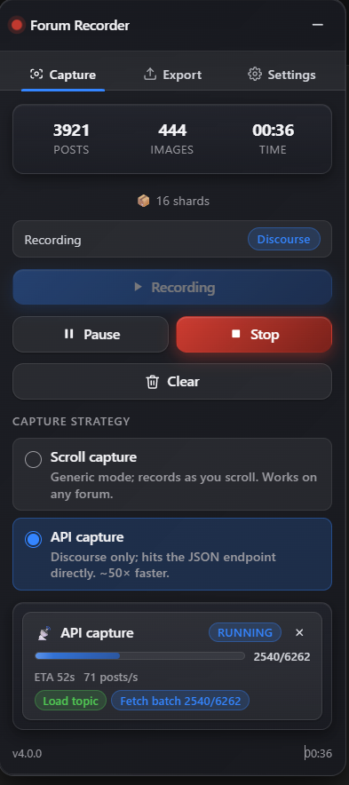
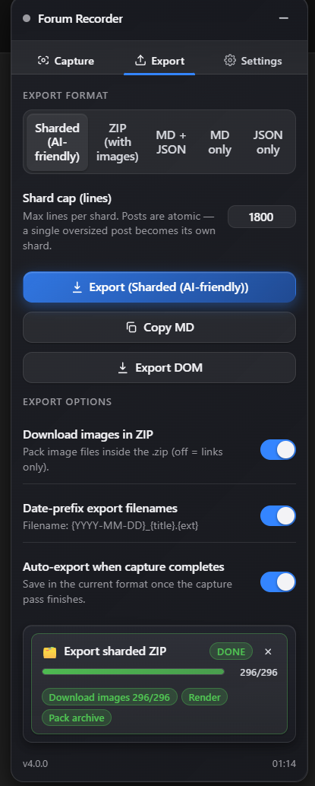
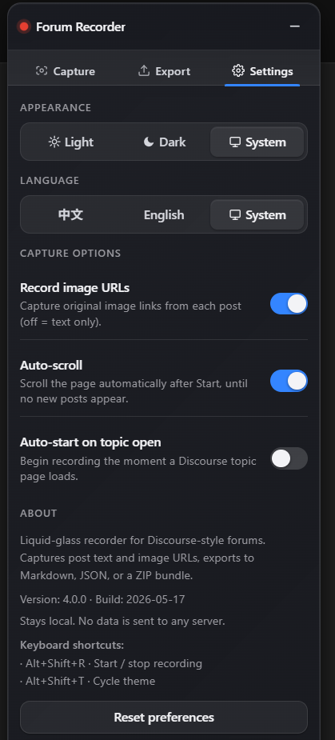
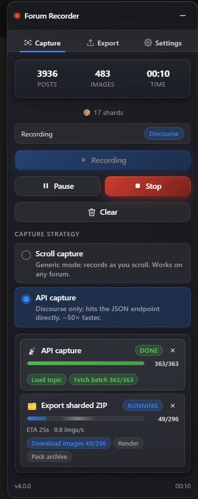

# Discourse Text Recorder


A liquid‑glass **userscript** that records Discourse forum threads — every post's text (converted to Markdown) and its image URLs — while you read, then exports the thread to **Markdown / JSON / ZIP**, including an **AI‑friendly sharded bundle**. Tabbed UI, bilingual (中文 / English, auto‑detected), and light / dark / system themes. *(The in‑app dock is labelled "Forum Recorder".)*

> 中文简介：一个"液态玻璃"风格的**油猴脚本**。在你浏览 Discourse 论坛主题时，自动把每个楼层的正文（转成 Markdown）和图片链接记录下来，一键导出 **Markdown / JSON / ZIP**（含面向 AI 的分片包）。标签页界面、中英双语自动检测、浅色 / 深色 / 跟随系统主题。

🔒 **Stays local.** The only network requests it makes are to the forum you're already on (Discourse's own JSON API) and, when you export a ZIP with image download enabled, to the image URLs themselves. Nothing is ever sent to a third‑party server.

Tested against [`uscardforum.com`](https://uscardforum.com) (Discourse 2026.5.x). On non‑Discourse pages a generic fallback still captures visible text as you scroll.

---

## Screenshots

<table>
  <tr>
    <td align="center" width="50%">
      <br>
      <sub><b>Capture</b> — API capture streaming a 6,200‑post thread at ~71 posts/s, with a live shard‑count preview.</sub>
    </td>
    <td align="center" width="50%">
      <br>
      <sub><b>Export</b> — pick a format (Sharded / ZIP / MD+JSON / MD / JSON), set the shard cap, one‑click export.</sub>
    </td>
  </tr>
  <tr>
    <td align="center" width="50%">
      <br>
      <sub><b>Settings</b> — theme, language (中文 / English / System), capture options, and keyboard shortcuts.</sub>
    </td>
    <td align="center" width="50%">
      <br>
      <sub><b>Activity panel</b> — every capture/export runs as a cancellable task card with stages, throughput and ETA.</sub>
    </td>
  </tr>
</table>

---

## Features

- **Whole‑thread capture** — records post number, author (username + full name), timestamp, permalink, body (HTML → Markdown), image URLs, and like count.
- **Two capture strategies**
  - **API** *(default, Discourse only)* — reads Discourse's JSON endpoints directly. ~50× faster on long threads and never misses a post to virtual scrolling.
  - **Scroll** — auto‑advances the page so the SPA hydrates each batch; also the generic fallback that works on **any** site.
- **Five export formats** — flat Markdown, JSON, MD + JSON, self‑contained **ZIP** (with downloaded images), and an **AI‑friendly sharded ZIP**.
- **One‑click "Auto Record & Save"** — start → wait for the capture pass to finish → export → stop, in a single action. Optional auto‑start on topic open and auto‑export on completion.
- **Activity panel** — real‑time task cards with per‑stage progress, throughput, ETA, cancel, and one‑click retry of failed image downloads.
- **Bilingual** — 中文 / English, auto‑detected from your browser language, overridable in Settings.
- **Liquid‑glass UI** — draggable, snap‑to‑edge dock; light / dark / system theming that touches only the recorder's own UI, never the host page.
- **Image handling** — captures the original (de‑thumbnailed) image URL, and can download the bytes into the ZIP for a fully offline archive.
- **No dependencies in the bundle** — even the ZIP writer is hand‑rolled; the build ships as a single readable `.user.js`.

---

## How it works

### Capture modes

| Mode | When | Mechanism |
|---|---|---|
| **discourse** | the page is detected as Discourse | Seeds from the page's preloaded JSON, then watches `.post-stream` via `MutationObserver` + a throttled scroll listener so virtualised posts are re‑scanned. |
| **generic** | any non‑Discourse page (fallback) | An `IntersectionObserver` visits each text block (`p`, `li`, headings, `blockquote`, `.cooked`, …) as it scrolls into view, de‑duplicated by tag + leading text. |

### Capture strategies (Discourse mode)

- **API capture** — fetches `/t/<id>.json` for the topic meta and the full post‑ID stream, then batch‑fetches posts 20 at a time via `/t/<id>/posts.json?post_ids[]=…`. Cancellable mid‑run; a 6,000‑post thread finishes in well under a minute.
- **Scroll capture** — the `AutoScroll` loop advances the viewport ~0.85 screen per tick and stops automatically when it reaches the bottom and the post count stops growing (with a safety cap).

Both strategies merge into the same store, so **Pause / Resume / Stop** and live counters behave identically.

---

## Install

### 1. Prerequisites

- **Node.js 18+** and npm
- A userscript manager: **[Tampermonkey](https://www.tampermonkey.net/)** or **[Violentmonkey](https://violentmonkey.github.io/)** (Chrome / Edge / Firefox)

### 2. Build from source

```bash
git clone https://github.com/AleXbMaximum/Discourse-exporter.git
cd Discourse-exporter
npm install
npm run build        # → .dist/discourse-text-recorder.user.js
```

### 3. Load it into your manager

1. Open the built file `.dist/discourse-text-recorder.user.js` in your browser — the manager will prompt to install it. *(Or open the manager, **Create a new script**, and paste the file's contents.)*
2. Visit any Discourse forum (e.g. `https://uscardforum.com/t/<topic>/<id>`). The liquid‑glass dock appears at the **bottom‑right**.

---

## Usage

1. **Open a topic**, then click **Recording** (or press `Alt+Shift+R`). The stats card shows live **posts / images / elapsed time** and a shard‑count preview.
2. Leave the default **API** strategy on for Discourse sites — it captures the whole thread on its own. On other sites, **Scroll** capture walks the page for you.
3. **Pause / Resume** freezes captures without detaching observers (paused time is excluded from the timer); **Stop** ends the session; **Clear** resets it.
4. Switch to the **Export** tab, choose a format, and click **Export** — or use **Copy MD** to drop the transcript onto your clipboard, or **Export DOM** to save a raw page snapshot.

**One‑click flow:** enable *Auto‑export when capture completes* (and optionally *Auto‑start on topic open*) and the recorder will capture the whole thread and save it without further clicks.

### Keyboard shortcuts

| Shortcut | Action |
|---|---|
| `Alt+Shift+R` | Start / stop recording |
| `Alt+Shift+T` | Cycle theme (light → dark → system) |

### Settings reference

| Setting | Default | What it does |
|---|---|---|
| Theme | System | Light / Dark / System (follows `prefers-color-scheme`) |
| Language | System | 中文 / English / System (auto from browser language) |
| Capture strategy | **API** | `API` (Discourse JSON) or `Scroll` (generic) |
| Export format | **ZIP** | Sharded · ZIP · MD + JSON · MD · JSON |
| Record image URLs | On | Capture each post's original image links |
| Download images in ZIP | On | Embed image files in the archive (off = links only) |
| Auto‑scroll | On | Auto‑advance the page during Scroll capture |
| Auto‑start on topic open | Off | Begin recording as soon as a topic loads |
| Auto‑export when capture completes | Off | Export automatically at the end of the pass |
| Date‑prefix export filenames | On | Name files `{YYYY-MM-DD}_{title}` |
| Shard cap (lines) | 1800 | Max rendered lines per shard, 400–2000 |

---

## Export formats

| Format | Output | Best for |
|---|---|---|
| **MD only** | `{name}.md` | A human‑readable transcript |
| **JSON only** | `{name}.json` | Structured, machine‑readable data |
| **MD + JSON** | both files | Both at once |
| **ZIP (with images)** | `{name}.zip` | A self‑contained, shareable archive |
| **Sharded (AI‑friendly)** | `{name}.zip` | Feeding a large thread to an AI agent |

**ZIP** contains the Markdown and JSON, a `page.html` DOM snapshot (with the recorder's own UI stripped out), a short `README.txt`, and an `images/` folder of downloaded images. The Markdown inside references those local image paths, so the archive is fully usable offline.

**Sharded ZIP** is built for AI agents that read files under a per‑request line cap:

```
{name}/
├── README.md      navigation guide + stats + gap detection
├── index.md       post# → <shard>:<line>  (metadata only — no content excerpts)
├── by-user.md     user → post#:line inverted index
├── posts.jsonl    one post per line (Grep-friendly)
├── posts/
│   ├── p0001-0040.md
│   └── …           contiguous shards, each ≤ the shard cap
├── page.html      DOM snapshot
└── images/        downloaded images (if enabled)
```

Every shard fits under a typical AI per‑read line limit (default 1800 ≤ 2000), so a thousand‑post thread is navigable without loading it all at once. The index files carry **only structural metadata** — never truncated content — so an agent can't mistake the index for the source, and `README.md` flags any gaps left by deleted posts.

---

## npm scripts

| Script | What it does |
|---|---|
| `npm run build` | Production bundle at `.dist/discourse-text-recorder.user.js` (with source map) |
| `npm run build:map` | Same, but inline source map (single‑file install for debugging) |
| `npm run dev` | Watch mode — webpack rebuilds on save |
| `npm run typecheck` | Strict TypeScript check (no emit) |
| `npm run lint` / `lint:fix` | ESLint (typescript‑eslint) |
| `npm run format` | Prettier across the repo |
| `npm run clean` | Remove `.dist/` |

The bundle is intentionally **not minified** — userscripts are usually audited by the people who install them, so readability wins. Webpack's `BannerPlugin` prepends `Dev/src/header.txt` verbatim so the manager sees the `@grant` / `@match` metadata.

---

## Architecture

```
Dev/src/
  main.ts                     entry — builds the service bag, boots the SPA poll
  header.txt                  userscript metadata (prepended by BannerPlugin)
  global.d.ts                 ambient GM_* typings
  bootstrap/
    config.ts                 SCRIPT_CONFIG: namespace, version, storage keys, z-index, shard caps
    serviceFactory.ts         dependency-injected service bag
    renderEngine/             reactive render loop
    initializer.ts            SPA-aware boot poll · keyboard shortcuts · auto-start
    domReady.ts
  core/
    store.ts                  single reactive state + settings hydration
    eventBus.ts               typed pub/sub
    taskRegistry.ts · tasks.ts  task model behind the Activity Panel
    types.ts
  extractor/
    discourse.ts              page detection · topic meta · post extraction · preloaded seed
    discourseApi.ts           JSON API capture (/t/<id>.json, posts.json batches)
    htmlToMarkdown.ts         Discourse "cooked" HTML → Markdown
    images.ts                 lightbox thumbnail → original image URL
  recorder/
    recorder.ts               orchestration · modes · pause/resume · Auto Record & Save
    autoScroll.ts             viewport auto-advance with stall / bottom detection
  exporter/
    exporter.ts               MD / JSON / ZIP / sharded builders + downloaders
    zip.ts                    dependency-free STORE-mode ZIP writer (CRC-32)
    imageDownload.ts          GM_xmlhttpRequest image fetcher
    imageRetry.ts             retry failed downloads
  infra/
    i18n/                     bilingual zh / en, auto-detected
    logging/                  structured, namespaced logger
    storage/                  GM_setValue / localStorage dual-write
  ui/
    components/               Dock · Tabs · Modal · Toast · Button · Switch · Segmented · …
      tabs/                   CaptureTab · ExportTab · SettingsTab
      activity/               ActivityPanel · TaskCard · TaskFailureList
    styles/                   three-tier --dtr-* design tokens · glass · dark mode · partials
    utils/rimLighting.ts      mouse-tracked glass rim highlight
  utils/                      async · dom · throughput · value
```

**Data flow**

```
page ──► extractor (DOM observer · scroll · Discourse JSON API)
            │
            ▼
        core/store ──(capture:tick)──► ui/dock re-renders
            │
  Export ──┴─► exporter (MD · JSON · ZIP · sharded) ──► download
                        │
                  core/taskRegistry ──► Activity Panel (progress · ETA · retry)
```

---

## Project layout

```
Discourse-exporter/
├── Dev/src/             source (see Architecture)
├── docs/screenshots/    README images
├── .dist/               build output (gitignored)
├── webpack.config.js    webpack + BannerPlugin (reads Dev/src/header.txt)
├── tsconfig.json        strict TypeScript
├── eslint.config.cjs    flat config, typescript-eslint
├── package.json
├── LICENSE
└── README.md
```

---

## Permissions & privacy

The userscript matches all sites (`@match *://*/*`) so it can detect Discourse on any domain; on non‑Discourse pages it simply offers generic capture. The granted `GM_*` APIs are used as follows:

| Grant | Why |
|---|---|
| `GM_getValue` / `GM_setValue` / `GM_deleteValue` | Persist your settings locally |
| `GM_setClipboard` | "Copy MD" |
| `GM_addStyle` | Inject the dock's styles |
| `GM_xmlhttpRequest` + `@connect *` | Download image bytes (cross‑origin) when building a ZIP |

No analytics, no telemetry, no remote calls beyond the forum and the image hosts described above.

---

## Compatibility

- **Browsers:** last 2 versions of Chrome, Firefox, and Edge (Babel build target).
- **Managers:** Tampermonkey, Violentmonkey.
- **Forums:** any Discourse instance; generic text capture elsewhere.

---

## License

[MIT](LICENSE)
